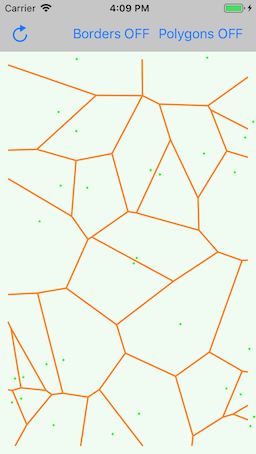
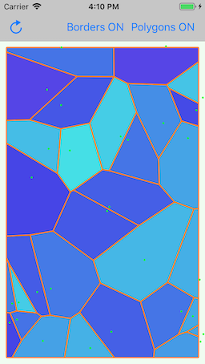

<p>
    
</p>

# VoronoiLibSwift
Swift implementation of Fortunes Algorithm.

This is a port of [Zalgo2462/VoronoiLib](https://github.com/Zalgo2462/VoronoiLib) from C# to Swift.
In addition to the original C# library, this Swift library optionally generates polygons for the sites.

## Xcode projects
* *VoronoiLibSwift.xcodeproj* builds an iOS framework to be used as a library.
* *VoronoiLibSwiftExample.xcodeproj* includes the VoronoiLibSwift framework and contains an example iOS App which renders a voronoi graph.

## Usage

### Generating Voronoi site edges

Make an array of `SitePoint<UserData>`. The generic parameter `UserData` can be `Void` if you only need the edges.
Specify a location for each site point by passing a `SIMD2<Double>` x,y coordinates value.
Make a `ClipRect` which will define the borders of the voronoi graph.
Call `Voronoi.runFortunesAlgorithm` and pass the site points and the clipRect as arguments (and an empty `Option` set for the `options` parameter).

```swift
let sitePoints: [SitePoint<Void>] = [
  SitePoint(point: SIMD2<Double>(x: 20, y: 30)),
  //other site points...
]

let clipRect = ClipRect.minMaxXY(minX: 0, minY: 0, maxX: 50, maxY: 50)

let result = Voronoi.runFortunesAlgorithm(sitePoints: sitePoints, clipRect: clipRect, options: [])
```

The result will be a tuple, containing the edges and sites for the Voronoi graph:

`(edges: [Edge<Void>], sites: [Site<Void>])`

The edges can be rendered like this:



### Generating Voronoi site polygons

When you need the exact shape of the sites, for example to paint each site with different colors, you can enable the generation of polygon vertices for each site.

For example, specify `UIColor` for the `UserData` generic parameter of `SitePoint`.
Give each `SitePoint` a value for the `userData` parameter (for example `UIColor.blue`).
Pass a set containing `Voronoi.Option.makeSitePolygonVertices` into the `options` parameter of `Voronoi.runFortunesAlgorithm`.

```swift
let sitePoints: [SitePoint<UIColor>] = [
  SitePoint(point: SIMD2<Double>(x: 20, y: 30), userData: .blue)
  //other site points...
]

let clipRect = ClipRect.minMaxXY(minX: 0, minY: 0, maxX: 50, maxY: 50)

let result = Voronoi.runFortunesAlgorithm(sitePoints: sitePoints, clipRect: clipRect, options: [.makeSitePolygonVertices])
```

The result will be a tuple, containing the edges and the sites for the Voronoi graph.

`(edges: [Edge<UIColor>], sites: [Site<UIColor>])`

For each site, the polygon vertices are accessable with the property `polygonVertices`. The vertices are ordered properly and ready to be rendered as polygons.

Use the `userData` property to get extra infos for the sites like the color to fill the polygons.


Computing the polygons takes more time than just the edes.

The option `Voronoi.Option.makeEdgesOnClipRectBorders` will also generate edges on the border of the graph (the `clipRect` border):


